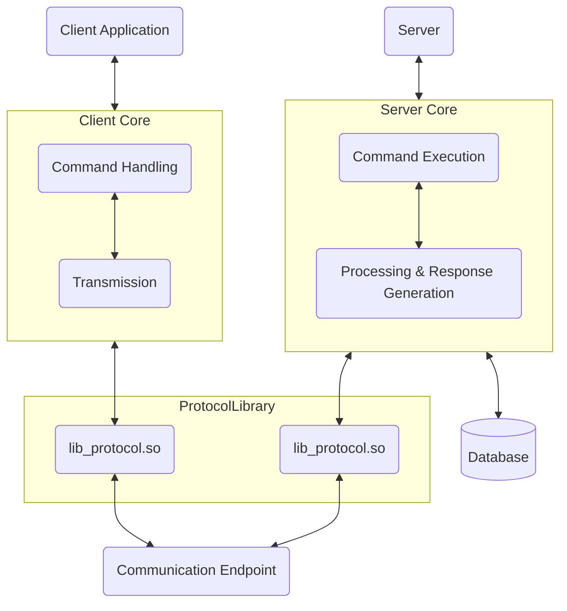
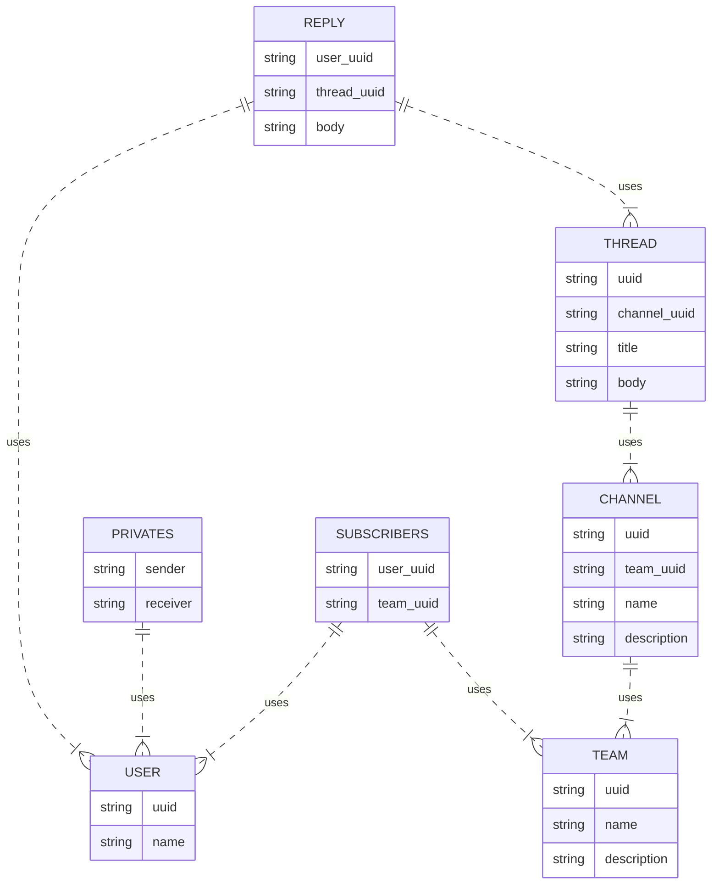

# MY_TEAMS

<b>binary name:</b> ``myteams_server``, ``myteams_cli``  
<b>language:</b> C  
<b>compilation:</b> via Makefile, including re, clean and fclean rules

> [!CAUTION]
> - The totality of your source files, except all useless files (binary, temp files, obj files,...), must be included in your delivery.
> - All the bonus files (including a potential specific Makefile) should be in a directory named bonus.

The goal of this project is to create a **server** and a **CLI client**.  
You MUST create your own protocol and describe it in a RFC’s style documentation.  
You MUST create your own data model in compliance with the given library technical properties.  
You MUST implement requested commands in the **CLI client**.  
You MUST use the given server and client libraries to print every events and data.  
The network communication will be achieved through the use of TCP sockets.  
You MUST push the given logging library and its includes at the root of the repo in a subfolder ``libs`` like ``root_of_your_repository/libs/myteams/[extracted files]``.

## GENERAL INFORMATIONS
Please note that all arguments of the existing commands should be quoted with double quotes.  
A missing quote should be interpreted as an error.  
Please note that all the names, descriptions and message bodies have a pre-defined length which will be as follow:
- `MAX_NAME_LENGTH` 32
- `MAX_DESCRIPTION_LENGTH` 255
- `MAX_BODY_LENGTH` 512

You don’t have to spend too much time on the information display.
You MUST therefore use the functions provided by the logging library (and only these) to display the information given by the server.  
Please look at the display library header, to find the variables of each data structure

## COMMANDS

| Command                                           | Description                                                               |
|---------------------------------------------------|---------------------------------------------------------------------------|
| `/help`                                           | Show help                                                                 |
| `/login ["user_name"]`                            | Set the user_name used by client                                          |
| `/logout`                                         | Disconnect the client from the server                                     |
| `/users`                                          | Get the list of all users that exist on the domain                        |
| `/user ["user_uuid"]`                            | Get details about the requested user                                      |
| `/send ["user_uuid"] ["message_body"]`           | Send a message to specific user                                           |
| `/messages ["user_uuid"]`                        | List all messages exchanged with the specified user                       |
| `/subscribe ["team_uuid"]`                       | Subscribe to the events of a team and its sub directories                  |
| `/subscribed ?["team_uuid"]`                     | List all subscribed teams or list all users subscribed to a team           |
| `/unsubscribe ["team_uuid"]`                     | Unsubscribe from a team                                                    |
| `/use ?["team_uuid"] ?["channel_uuid"] ?["thread_uuid"]` | Sets the command context to a team/channel/thread                 |
| `/create`                                         | Based on the context, create the sub resource (see below)                 |
| `/list`                                           | Based on the context, list all the sub resources (see below)              |
| `/info`                                           | Based on the context, display details of the current resource (see below) |

### CREATE
| Command                                                                     | Description                                    |
|-----------------------------------------------------------------------------|------------------------------------------------|
| `/create ["team_name"] ["team_description"]`                                | Create a new team                             |
| `/create ["channel_name"] ["channel_description"]`                          | Create a new channel                          |
| `/create ["thread_title"] ["thread_message"]`                               | Create a new thread                           |
| `/create ["comment_body"]`                                                 | Create a new reply                            |

### LIST
| Command                                                                     | Description                                    |
|-----------------------------------------------------------------------------|------------------------------------------------|
| `/list`                                                                     | List all existing teams                       |
| `/list`                                                                     | List all existing channels (when `team_uuid` is defined)           |
| `/list`                                                                     | List all existing threads (when both `team_uuid` and `channel_uuid` are defined) |
| `/list`                                                                     | List all existing replies (when `team_uuid`, `channel_uuid`, and `thread_uuid` are defined) |

### INFO
| Command                                                                     | Description                                    |
|-----------------------------------------------------------------------------|------------------------------------------------|
| `/info`                                                                     | Display currently logged-in user details                         |
| `/info`                                                                     | Display currently selected team details (when `team_uuid` is defined)                   |
| `/info`                                                                     | Display currently selected channel details (when both `team_uuid` and `channel_uuid` are defined) |
| `/info`                                                                     | Display currently selected thread details (when `team_uuid`, `channel_uuid`, and `thread_uuid` are defined) |

## SOCKET

Each packet follows the following structure:

```c
    +-------------+-------------------------+--------------+
    | Packet Type |      Network Data       |   Payload    |
    |   (1 byte)  | (p_network_data_t size) | (4096 bytes) |
    +-------------+-------------------------+--------------+
```

> [!NOTE]
> The packet type is a single byte that indicates the type ofpacket being sent. The network data is a structure that containsinformation about the sender and receiver of the packet, as well as the timestamp ofthe packet.  
> The payload contains the actual data being sent, such asmessages, commands, or responses.

The payload of the packet is a `uint8_t` array of `4096 bytes`, which can be used to send messages, commands, or responses. The payload canbe of variable length, depending on the type of data being sent.

The following network data structure is defined in the Protocol:
```h
    /**
     * @struct p_network_data_s
     * @brief Represents network data including socket file descriptor and
     * server address.
     */
    typedef struct p_network_data_s {
        int sockfd;                  /**< Socket file descriptor */
        struct sockaddr_in server_addr; /**< Server address */
    } p_network_data_t;
```

## EVENTS

| Event                      | Description                                            |
|----------------------------|--------------------------------------------------------|
| EVT_LOGIN                  | User successfully logs in to the system.               |
| EVT_DISCONNECT             | User gets disconnected from the server.                |
| EVT_LIST_USERS             | Request to list all users existing on the domain.      |
| EVT_SEND                   | Message sent to a specific user.                       |
| EVT_LIST_MESSAGES          | Request to list all messages exchanged with a user.    |
| EVT_SUBSCRIBE              | User subscribes to another user's events.              |
| EVT_LIST_SUBSCRIBED_IN_TEAM| Request to list all users subscribed to team events.   |
| EVT_LIST_SUBSCRIBED_TEAMS  | Request to list all teams user is subscribed to.       |
| EVT_UNSUBSCRIBE            | User unsubscribes from another user's events.          |
| EVT_CREATE_TEAM            | New team is created.                                   |
| EVT_CREATE_CHANNEL         | New channel is created within a team.                  |
| EVT_CREATE_THREAD          | New thread is created within a channel.                |
| EVT_CREATE_REPLY           | Reply is created within a thread.                      |
| EVT_LIST_TEAMS             | Request to list all existing teams.                    |
| EVT_LIST_CHANNELS          | Request to list all channels within a team.            |
| EVT_LIST_THREADS           | Request to list all threads within a channel.          |
| EVT_LIST_REPLIES           | Request to list all replies within a thread.           |
| EVT_INFO_USER              | Request to get detailed information about a user.      |
| EVT_INFO_TEAM              | Request to get detailed information about a team.      |
| EVT_INFO_CHANNEL           | Request to get detailed information about a channel.   |
| EVT_INFO_THREAD            | Request to get detailed information about a thread.    |
| EVT_PING                   | Server pings to check client's connection status.      |
| EVT_MESSAGE_RECEIVE        | Message is received.                                   |
| EVT_REPLY_CREATE           | Reply is created.                                      |
| EVT_TEAM_CREATE            | Team is created.                                       |
| EVT_THREAD_CREATE          | Thread is created.                                     |
| EVT_CHANNEL_CREATE         | Channel is created.                                    |
| EVT_CONTINUE               | Used to continue a process or operation.               |
| EVT_ERROR                  | Indicates an error condition.                          |
| EVT_ERROR_UNKNOWN          | Signifies an unknown error.                            |
| EVT_ERROR_UNAUTHORIZED     | User is unauthorized to perform an action.             |
| EVT_ERROR_ALREADY          | User is already subscribed.                            |

## ARCHITECTURE

> [!NOTE]
> The client application communicates with the server application using the MyTeams protocol. The protocol defines the format of the packets exchanged between the client and server, enabling seamless communication and collaboration between users.

The following diagram illustrates the architecture of the MyTeams protocol:



### Database


