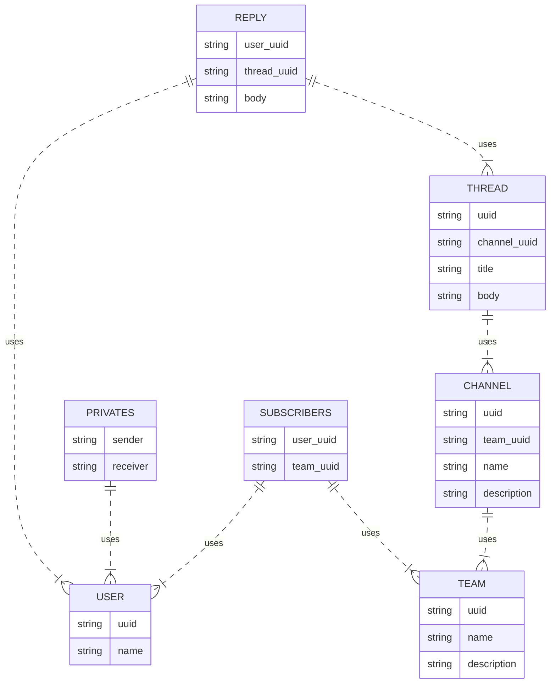

# Database

```mermaid
erDiagram
    USER {
        string uuid
        string name
    }

    TEAM {
        string uuid
        string name
        string description
    }

    CHANNEL ||..|{ TEAM: uses
    CHANNEL {
        string uuid
        string team_uuid
        string name
        string description
    }

    THREAD ||..|{ CHANNEL: uses
    THREAD {
        string uuid
        string channel_uuid
        string title
        string body
    }

    REPLY ||..|{ USER: uses
    REPLY ||..|{ THREAD: uses
    REPLY {
        string user_uuid
        string thread_uuid
        string body
    }

    PRIVATES ||..|{ USER: uses
    PRIVATES {
        string sender
        string receiver
    }

    SUBSCRIBERS ||..|{ USER: uses
    SUBSCRIBERS ||..|{ TEAM: uses
    SUBSCRIBERS {
        string user_uuid
        string team_uuid
    }
```
